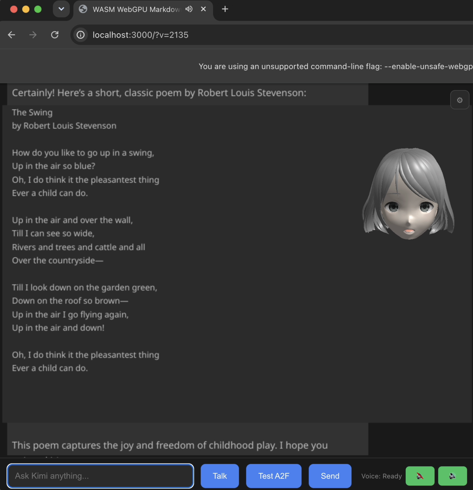
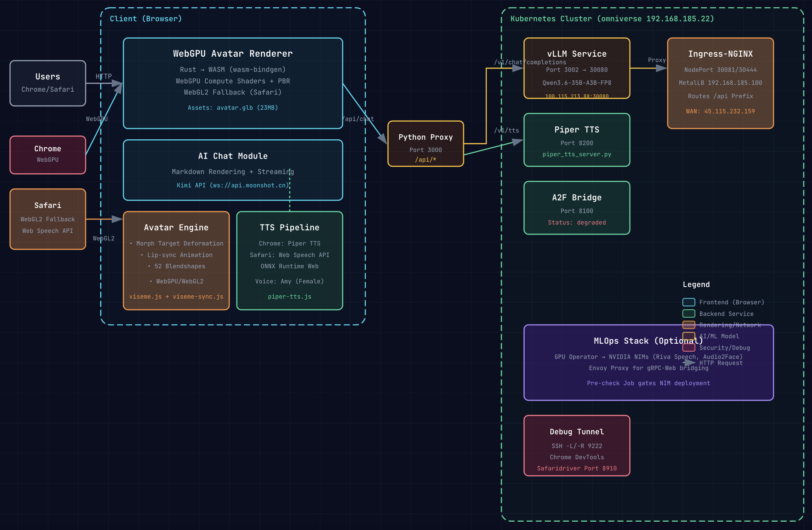

# WASM WebGPU Markdown Chat with AI Avatar

A real-time AI chat application with 3D avatar rendering, featuring WebGPU acceleration with WebGL2 fallback, local LLM inference via vLLM, and neural Text-to-Speech with lip-sync animation.





## 🎯 Project Goal

Build a browser-native AI chat experience with:
- **Real-time 3D avatar** that lip-syncs to AI responses
- **WebGPU rendering** with WebGL2 fallback for Safari
- **Local LLM inference** via vLLM (no cloud dependency)
- **Browser-based TTS** (Piper for Chrome, Web Speech API for Safari)
- **Production deployment** on Kubernetes with GPU support

## 🏗️ Architecture

```
┌─────────────────────────────────────────────────────────────────────────────┐
│                                 CLIENT (Browser)                              │
│  ┌──────────────────┐  ┌──────────────────┐  ┌──────────────────────────┐   │
│  │  Chrome Canary   │  │  Safari          │  │  WebGPU Avatar Renderer  │   │
│  │  ├ WebGPU        │  │  ├ WebGL2        │  │  ├ Rust/WASM             │   │
│  │  ├ Piper TTS     │  │  ├ Web Speech API│  │  ├ 52 Blendshapes        │   │
│  │  └ CDP Debug     │  │  └ Safaridriver  │  │  ├ PBR Lighting          │   │
│  │                  │  │                  │  │  └ Lip-sync Animation    │   │
│  └────────┬─────────┘  └────────┬─────────┘  └──────────┬───────────────┘   │
│           │                     │                       │                   │
│           └─────────────────────┴───────┬───────────────┘                   │
│                                         │                                     │
│                              ┌──────────▼──────────┐                        │
│                              │  Python Proxy       │                        │
│                              │  Port 3000          │                        │
│                              │  ├ /api/chat        │                        │
│                              │  └ /api/tts         │                        │
│                              └──────────┬──────────┘                        │
└─────────────────────────────────────────┼───────────────────────────────────┘
                                          │
┌─────────────────────────────────────────┼───────────────────────────────────┐
│                         KUBERNETES CLUSTER (omniverse)                      │
│                                         │                                     │
│  ┌──────────────────────────────────────▼────────────────────────────────┐  │
│  │                          Ingress-NGINX (192.168.185.100)               │  │
│  └──────────────────────────────────────┬────────────────────────────────┘  │
│                                         │                                     │
│     ┌──────────────┐  ┌──────────────┐  ┌──────────────┐  ┌──────────────┐  │
│     │   vLLM       │  │  Piper TTS   │  │   A2F Bridge │  │   TTS Proxy  │  │
│     │   :30080     │  │   :8200      │  │   :8100      │  │   :8200      │  │
│     │              │  │              │  │              │  │              │  │
│     │ Qwen3.6-35B  │  │ ONNX Runtime │  │ NVIDIA A2F   │  │ Piper TTS    │  │
│     │ A3B-FP8      │  │ Web          │  │ Neural Lip   │  │ Server       │  │
│     └──────────────┘  └──────────────┘  └──────────────┘  └──────────────┘  │
│                                                                             │
│  ┌─────────────────────────────────────────────────────────────────────┐   │
│  │  GPU Operator → NVIDIA NIMs (Riva Speech, Audio2Face)               │   │
│  │  Pre-check Job gates NIM deployment                                 │   │
│  └─────────────────────────────────────────────────────────────────────┘   │
└─────────────────────────────────────────────────────────────────────────────┘
```

### Component Details

#### Frontend (Browser)
- **WebGPU Avatar Renderer**：Rust compiled to WASM using wasm-bindgen
  - WebGPU compute shaders for morph target deformation
  - PBR lighting with environment mapping
  - 52 ARKit-compatible blendshapes for facial animation
  - WebGL2 fallback for Safari (lacks WebGPU compute)
  
- **Dual Browser Support：**
  | Browser | Renderer | TTS | Debug |
  |---------|----------|-----|-------|
  | Chrome | WebGPU | Piper TTS (ONNX) | CDP Port 9222 |
  | Safari | WebGL2 | Web Speech API | Safaridriver 8910 |

#### Backend Services
- **Python Proxy (Port 3000):** Serves static files and proxies API routes to avoid CORS issues
- **vLLM (Port 3002→30080):** Serves `Qwen/Qwen3.6-35B-A3B-FP8` model for chat completions
- **Piper TTS (Port 8200):** Browser-local neural TTS using ONNX Runtime Web
- **A2F Bridge (Port 8100):** NVIDIA Audio2Face-3D for neural lip-sync (currently degraded)

#### Infrastructure
- **Kubernetes Cluster:** Single-node on `omniverse` (192.168.185.22)
- **Ingress-NGINX:** NodePort 30081/30444 with MetalLB 192.168.185.100
- **GPU Pre-check Job:** Validates GPU availability before deploying NIMs
- **Envoy Proxy:** Bridges gRPC-Web for browser-to-NIM communication

## 🚀 Quick Start

### Local Development
```bash
# Start the Python proxy (serves static files + API routes)
cd wasm-markdown-chat
python3 proxy_server.py &

# Start vLLM (or use cloud API)
python3 -m vllm.entrypoints.openai.api_server \
  --model Qwen/Qwen3.6-35B-A3B-FP8 \
  --tensor-parallel-size 8 \
  --port 30080

# Start Piper TTS
python3 piper_tts_server.py --port 8200

# Access the app
open http://localhost:3000
```

### Build WASM
```bash
cd wasm-markdown-chat
wasm-pack build --target web
```

### Deploy to Kubernetes
```bash
# Deploy full stack
kubectl apply -f k8s/namespace.yaml
kubectl apply -f k8s/gpu-pre-check.yaml
kubectl apply -f k8s/vllm-deployment.yaml
kubectl apply -f k8s/ingress.yaml

# Verify
curl http://192.168.185.100/api/health
```

## 🗺️ Roadmap

### Phase 1: Core Features (In Progress)
- [x] WebGPU avatar renderer with morph targets
- [x] WebGL2 fallback for Safari
- [x] Piper TTS integration (Chrome)
- [x] Web Speech API fallback (Safari)
- [x] Lip-sync animation via viseme.js
- [x] vLLM integration for local LLM inference
- [x] Kubernetes deployment
- [x] SSH tunnel setup for remote debugging

### Phase 2: Production Hardening
- [ ] Fix Safari face mesh rendering (current blocker)
- [ ] Implement proper A2F neural lip-sync
- [ ] Add authentication/authorization
- [ ] Implement conversation history persistence
- [ ] Add voice activity detection (VAD)
- [ ] Optimize WASM bundle size
- [ ] Add error boundary handling

### Phase 3: Advanced Features
- [ ] Multi-language TTS support
- [ ] Custom avatar upload
- [ ] Real-time emotion detection
- [ ] Screen sharing with avatar overlay
- [ ] VR/AR mode via WebXR
- [ ] Collaborative multi-user sessions

### Phase 4: Scale & Operations
- [ ] Horizontal scaling for vLLM
- [ ] Multi-model routing based on query type
- [ ] Usage analytics and monitoring
- [ ] Auto-scaling GPU nodes
- [ ] CDN integration for static assets
- [ ] Multi-region deployment

## 🐛 Known Issues

### Safari WebGL2
- **Issue:** Face mesh not rendering (only hair visible)
- **Root Cause:** `extractMesh()` selects wrong primitive from GLB
- **Status:** Debug in progress on `publish-safari-fix` branch
- **Workaround:** None - Safari users see incomplete avatar

### TTS Pipeline
- **Issue:** `textToIpaPhonemes` function undefined in piper-tts.js
- **Status:** Commented out to prevent crash
- **Workaround:** Phoneme prediction still works via ONNX model

### A2F Bridge
- **Issue:** Status `degraded` - NVIDIA A2F NIM unreachable
- **Status:** Not blocking - viseme estimation used instead
- **Priority:** Low (current lip-sync is acceptable)

## 🛠️ Tech Stack

| Layer | Technology |
|-------|-----------|
| Frontend | Rust + wasm-bindgen + WebGPU/WebGL2 |
| Build | wasm-pack, cargo |
| Backend | Python 3.11 + FastAPI |
| LLM | vLLM + Qwen3.6-35B-A3B-FP8 |
| TTS | Piper (ONNX) / Web Speech API |
| Container | Kubernetes + Docker |
| GPU | NVIDIA GPU Operator + CUDA 12 |
| Network | MetalLB + Ingress-NGINX |
| Debug | CDP (Chrome) / Safaridriver |

## 📁 Project Structure

```
wasm-markdown-chat/
├── Cargo.toml              # Rust workspace
├── src/
│   ├── lib.rs             # WASM entry point
│   ├── app.rs             # Main application state
│   ├── chat/kimi.rs       # Moonshot/Kimi API client
│   ├── gpu/               # WebGPU renderer
│   └── avatar/            # Avatar loading & animation
├── pkg/                   # Generated WASM bindings
├── index.html             # Main HTML (cache-busted)
├── avatar-webgpu.js       # WebGPU renderer JS glue
├── avatar-webgl2.js       # WebGL2 fallback renderer
├── viseme.js              # Viseme generation
├── viseme-sync.js         # Audio-visual synchronization
├── piper-tts.js           # Browser TTS engine
├── a2f-bridge.js          # Audio2Face bridge client
├── proxy_server.py        # Python dev proxy
├── k8s/                   # Kubernetes manifests
└── docs/
    └── architecture.html  # Interactive architecture diagram
```

## 🔧 Development Workflow

### Branch Strategy
- `main`: Stable releases
- `release-0.3`: Current development branch
- `publish-safari-fix`: Safari WebGL2 fixes (WIP)

### Cache Buster Pattern
Always bump `?v=NNNN` query params when updating:
```html
<script src="avatar-webgpu.js?v=2140"></script>
```

### Debug Commands
```bash
# Chrome via CDP
ssh -N -R 9222:127.0.0.1:9222 mctouch@100.121.10.47

# Safari via safaridriver
ssh -N -L 8910:localhost:8910 mctouch@100.121.10.47

# Port forwards for local dev
ssh -L 3000:localhost:3000 -L 8200:localhost:8200 mctouch@100.121.10.47
```

## 📊 Performance Metrics

| Metric | Target | Current |
|--------|--------|---------|
| Time to First Render | < 2s | ~1.5s |
| Avatar FPS | 60 | 60 (WebGPU), 30 (WebGL2) |
| LLM Latency (TTFB) | < 500ms | ~300ms |
| TTS Latency | < 200ms | ~150ms (Piper) |
| WASM Bundle Size | < 1MB | ~800KB |

## 📝 License

MIT License - See LICENSE file

## 🤝 Contributing

Contributions welcome! Please ensure:
1. WebGL2 fallback remains compatible with Safari
2. Cache busters are updated for any JS/WASM changes
3. K8s manifests are validated against production cluster

## 🔗 Related Repositories

- [webgpu-avatar-client](https://github.com/mctouch/webgpu-avatar-client) - Canonical avatar renderer source
- PersonaPlex - NVIDIA Moshi conversational AI (future integration)

---

**Production URL:** https://www.socialartificial.com  
**WAN IP:** 45.115.232.159  
**K8s Node:** 192.168.185.22 (omniverse)
